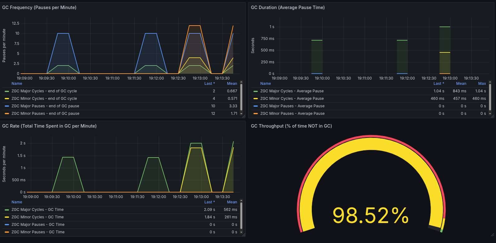

### Tuning a JVM and observing it using your local stack (01/26)

I had no idea on what I wanted to write in this post, or even if I wanted to write it. After all, this is just me experimenting with a _Java_ program. However, I think it is fun for the sake of learning and for me, the benefit was giving a break to my computer fans because they get quite active when I run some games.

Well, since I like to play _Minecraft_ from time to time, I had to open the launcher and figure out how to mess with the _JVM_ (no _Bedrock_ for me since I use _Linux_).

To my surprise, I found that the launcher default settings are quite modest in some parts and quite eager in other:

`-Xmx2G -XX:+UnlockExperimentalVMOptions -XX:+UseG1GC -XX:G1NewSizePercent=20 -XX:G1ReservePercent=20 -XX:MaxGCPauseMillis=50 -XX:G1HeapRegionSize=32M`

A _2 GB_ heap is quite small for a game that is very active in memory, the more when you generate your world by large chunks. The reservations in the heap are quite generous though, _400 MB_ will go to young generation and another _400 MB_ will go to reserved space so the _GC_ is not triggering full _GC_ events, except the regions are tuned for a _64 GB_ heap so _GC_ is incessant under this configuration... Did I mention the pause times? They are quite aggressive, so we end up with a graph showing _GC_ events non-stop... Something like 98 _GC_ pauses in 1 minute, so basically, 1 second of every minute doing garbage collection.

I thought I could do something about it, and my first take was... tuning the heap, except my first attempt was quite lousy, why? because I was very giving in the memory reservation parts.

#### Attempt 1

I figured out the heap was too small and the region size too large, especially for _G1GC_, so I just took a stab at that and changed those settings first:

`-Xms6G -Xmx6G -XX:+UnlockExperimentalVMOptions -XX:+UseG1GC -XX:G1NewSizePercent=20 -XX:G1ReservePercent=20 -XX:MaxGCPauseMillis=50 -XX:G1HeapRegionSize=8M`

This works for the allocation, but it creates pressure because, well, there are more objects to collect in the same period of time, the region is imperfect still, it is tuned for a _16GB_ heap. The collection at this point decreased to 35 events.

#### Attempt 2

After increasing the heap, I noticed allocation only requires _~5 GB_ of space, so I find no need to change the heap size, I think the region size is proper, I cannot see how many humongous objects I had or have at this point, but seeing no full garbage collection events, I believe the answer is none. So time to do something about frequency and reservation:

`-Xms6G -Xmx6G -XX:ParallelGCThreads=8 -XX:+UnlockExperimentalVMOptions -XX:+UseG1GC -XX:G1NewSizePercent=15 -XX:G1ReservePercent=15 -XX:MaxGCPauseMillis=120 -XX:G1HeapRegionSize=8M`

In this attempt I specified the `GCThreads` flag although it's unnecessary, the ergonomics were appropriate and having 8 cores in my machine, this just means verbosity. For the reservations, cutting to _900 MB_ (or the equivalent of using _300 MB_ with the previous heap) seems better suited for the work the collector is supposed to do, and the results confirm these decisions, the collection events are about 7 per minute. The extension in the pause threshold also helps greatly, now the collector has time to complete and the pauses are not that extensive anyway. At this point, the allocation moved from an initial _11.8 GB/min_ to _8.1 GB/min_.

At this point I was quite happy with the results, the fans were less busy and playing felt smooth at _~70 FPS_ (I don't like higher rates, I get dizzy). So just to satisfy my curiosity, I wanted to check if _ZGC_ would do a better job.

#### Attempt 3

To my disappointment, the viewer I used is quite old and didn't recognize the garbage collector, so I had to conform with reading the logs and really found not much difference, probably because I only let it run for a minute. I removed the reservation flags and let the collector take care while maintaining the same heap size:

`-Xms6G -Xmx6G -XX:+UseZGC -XX:+AlwaysPreTouch -XX:+ZGenerational -XX:+PrintGCDetails -Xlog:gc:file=gc.log`

I felt like something was missing, so I thought: "hey, there's a zero code _OTEL_ agent for that!", and well, I added those arguments to my _JVM_ settings:

`-Xms6G -Xmx6G -XX:+UseZGC -XX:+AlwaysPreTouch -XX:+ZGenerational -XX:+PrintGCDetails -Xlog:gc:file=gc.log -javaagent:.minecraft/opentelemetry-javaagent.jar -Dotel.service.name=minecraft -Dotel.exporter.otlp.endpoint=http://localhost:4317 -Dotel.metrics.exporter=otlp -Dotel.exporter.otlp.protocol=grpc -Dotel.javaagent.logging=application`

At this point my experiment became something else, but well, I had the _OTEL_ agent running, so I emitted metrics to _Prometheus_ through my collector and while I observed some improvement in allocation rate and overall memory usage being down by _~1 GB_ (still had pending adding those metrics to a dashboard), I also noticed more _GC_ activity, so the fans were spinning again. But well, I had some overhead to account for. So I believe that the attempt 2 for my case was the sweet spot.

Probably the mentioned dashboard proves me right...

I may continue playing with this before I go back to actually playing the game, but for now I have to say that this was a fun experiment to do. Unlike in previous exercises, I used _Claude_ to do some analysis on the results and it is undeniable that it is very useful, but the decisions on where to take the _JVM_ were all mine.